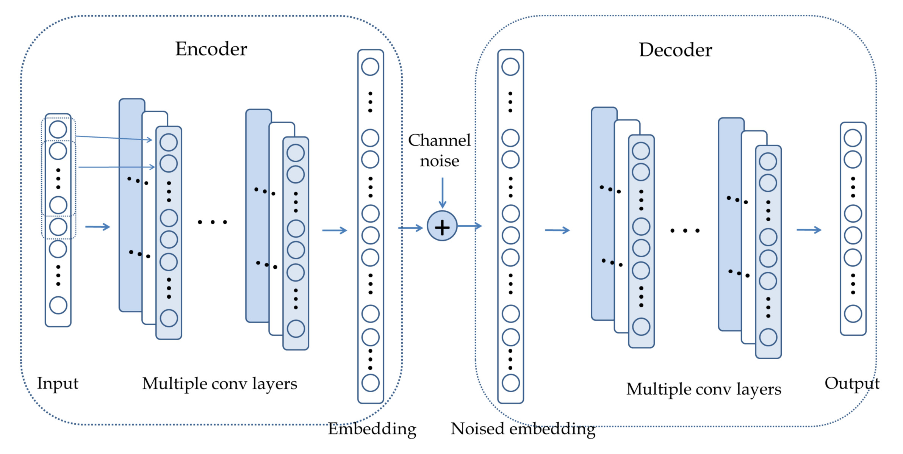

# This is the code for competition AI+无线通信 2020 NIAC https://naic.pcl.ac.cn/ with pytorch.

## requirements
- pytorch > 0.4
- numpy
- h5py

## result

test score = 0.67

## 原理

编码器将信息比特映射到一个定长嵌入层，再将嵌入层通过信道传给解码器。
这样解码器就只要解码嵌入层，而非人类设计的编码。

> 嵌入层：是使用在模型第一层的一个网络层，其将所有索引标号映射到致密的低维向量中

编码器包含了信道编码和调制。

